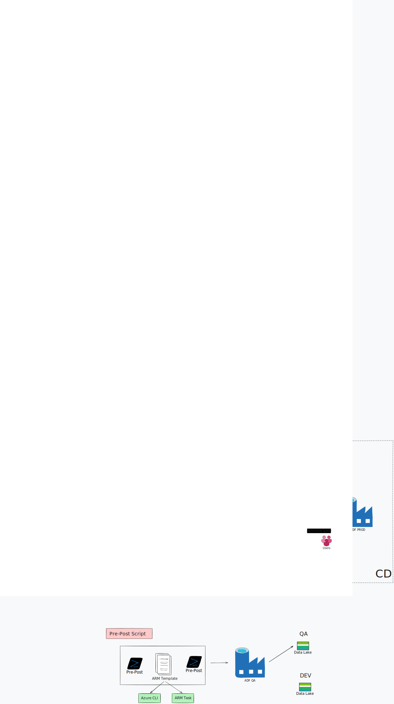

# Week 1 — Foundations: Understanding CI/CD & Azure Environment Setup

## 🎯 Sprint Goal
Understand the *why* behind CI/CD for data engineering before touching any tooling, then stand up the raw Azure infrastructure (three environments) that the rest of the project builds on.

## 📋 Scope for the Week
- Understanding CI/CD conceptually (DevOps vs. DataOps)
- Studying the target end-to-end architecture
- Requirement analysis for a 3-environment setup
- Azure account setup
- Resource Group creation (Dev / QA / Prod)
- Azure Data Factory instance creation (all 3 environments)
- Storage Account (Azure Blob Storage) provisioning
- Key Vault provisioning
- Initial Git conceptual groundwork
- Project planning and folder structure design

## 📸 Visuals

---

## 🗓️ Daily Breakdown

### Day 1 — CI/CD Fundamentals & Why Data Engineers Need It
- Studied the distinction between **DevOps** (general software delivery) and **DataOps** (the data-engineering-specific subset most senior data engineers own directly, without a dedicated DevOps team in the loop).
- Key realization: CI/CD for ADF isn't just "deploying code" — it's deploying **pipelines, linked services, datasets, storage accounts, and access policies together**, because ADF pipelines are only meaningful in the context of the infrastructure they point at.
- Documented why this skill shows up in nearly every data engineering job description: engineers who understand deployment write more modular, environment-agnostic pipelines from day one.

### Day 2 — Architecture Design (Whiteboarding)
- Sketched the full CI half and CD half of the pipeline before writing any code.
- Mapped out the **"why do we need Git at all"** problem: multiple developers editing one live ADF instance directly creates silent overwrite conflicts — there's no merge conflict resolution in the ADF canvas itself.
- Defined environment boundaries: **Dev (developer sandbox) → QA (business/user validation) → Prod (approval-gated, customer-facing)**.
- Decided on the two-branch model: `main` (protected, mirrors Live Mode) and `feature/*` (isolated developer work).

### Day 3 — Azure Account & Subscription Setup
- Verified Azure subscription access (Free Tier sufficient for this scale of resources).
- Explored the Azure Portal home page and got oriented with resource group navigation, since almost every subsequent action starts from a resource group.

### Day 4 — Resource Groups for All Three Environments
- Created three isolated resource groups, one per environment, following a consistent naming convention:
  - `ADF-CICD-Dev`
  - `ADF-CICD-QA`
  - `ADF-CICD-Prod`
- **Design decision:** keeping environments in separate resource groups (rather than tagging resources within one group) makes RBAC scoping, cost tracking, and eventual teardown much cleaner — and maps directly onto how the Azure DevOps Service Connection will later be scoped.

### Day 5 — Data Factory Provisioning (Dev)
- Provisioned the first Azure Data Factory instance (V2) inside `ADF-CICD-Dev`.
- **Naming mistake caught early:** first attempt accidentally named the Data Factory after the storage account convention instead of its own (`adf-storage-dev` instead of `adf-<project>-dev`). Deleted and recreated rather than patching via the ARM template UI, since it was faster at this stage of the project.
- Confirmed deployment via the **Deployment → Template** view in the portal — first hands-on look at the ARM template that underlies every ADF resource, which becomes central to the CI/CD pipeline later.

### Day 6 — Storage Account (Azure Blob Storage) + Key Vault
- Provisioned the Storage Account for Dev, explicitly selecting:
  - **Standard performance tier**
  - **LRS** (Locally Redundant Storage — sufficient for this workload, no cross-region replication needed)
  - ✅ **Hierarchical Namespace enabled** — flagged as a critical, easy-to-miss checkbox; without it the account behaves as flat blob storage rather than a true data lake.
- Provisioned Key Vault for Dev — noted at this stage (to be resolved in Week 2) that Key Vault's default **RBAC-based access control** blocks even the resource owner from creating secrets until an explicit **Key Vault Administrator** role assignment is made.

### Day 7 — Planning & Folder Structure
- Finalized the repository folder structure to be used from Week 2 onward (`cicd/`, `arm-params/`, `logs/`).
- Wrote out the Week 2–5 sprint plan so each week has a single clear technical theme rather than mixing concerns.

---

## 🏗️ Resources Provisioned This Week

| Resource | Environment | Notes |
|---|---|---|
| Resource Group `ADF-CICD-Dev` | Dev | ✅ |
| Resource Group `ADF-CICD-QA` | QA | ✅ (created, configured in Week 2) |
| Resource Group `ADF-CICD-Prod` | Prod | ✅ (created, configured in Week 5) |
| Azure Data Factory (Dev) | Dev | ✅ Provisioned, not yet Git-connected |
| Storage Account / Azure Blob Storage (Dev) | Dev | ✅ Hierarchical namespace confirmed |
| Key Vault (Dev) | Dev | ✅ Provisioned, RBAC access issue noted |

---

## 🧠 Technical Decisions

| Decision | Reasoning |
|---|---|
| Separate resource group per environment | Cleaner RBAC scoping, cost isolation, simpler teardown |
| Azure Blob Storage over plain Blob Storage | Hierarchical namespace required for data-lake-style folder semantics used later in pipeline design |
| LRS over GRS | Non-critical training workload; no cross-region DR requirement for this project's scope |
| Delete-and-recreate over ARM-edit for the naming mistake | Faster at this stage; ARM template editing workflow intentionally deferred to when it's actually needed (Week 4) |

---

## 🚧 Problems & Solutions

| Problem | Solution |
|---|---|
| Data Factory named incorrectly on first attempt | Deleted and recreated with correct naming convention rather than patching the ARM template manually |
| Uncertainty on Hierarchical Namespace default state | Explicitly verified the checkbox before proceeding — a skipped step here would have silently broken Gen2-dependent features later |
| Key Vault "operation not allowed by RBAC" seen when browsing secrets | Logged as a known blocker to resolve in Week 2 (requires explicit `Key Vault Administrator` role assignment) |

---

## 📚 Learnings

- ADF's "Live Mode" is not a Git-tracked state by default — Git integration has to be explicitly configured (this becomes the Week 2 focus).
- Every object created via the ADF UI has an ARM template equivalent — the drag-and-drop canvas is a UI layer over declarative JSON, not a separate system.
- Environment parity (matching resource types/config across Dev/QA/Prod) has to be intentional and manual at this stage — automating it is listed as a Future Enhancement in the master README.

## ✅ Week 1 Deliverables
- [x] Architecture diagram (CI half + CD half)
- [x] 3 Resource Groups provisioned
- [x] Dev environment: Data Factory + Storage (Azure Blob Storage) + Key Vault live
- [x] Project folder structure finalized
- [x] Sprint plan for Weeks 2–5 documented

**Next week:** Connect Dev's Data Factory to Azure DevOps Git, implement branch policies, configure Managed Identity access to Storage and Key Vault.