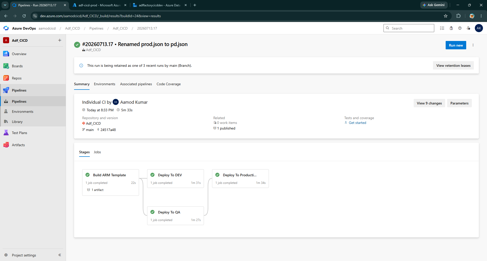
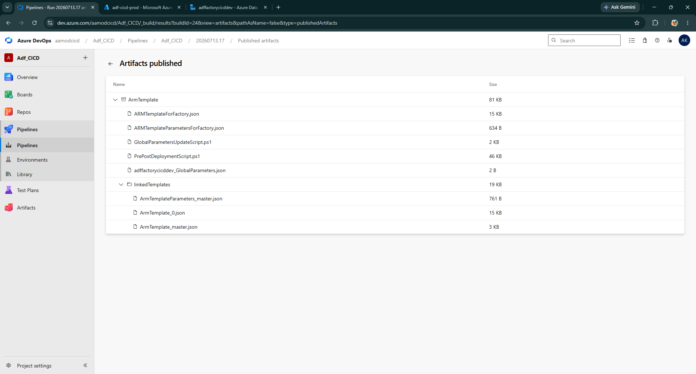

# Week 4 — Triggers, Manual Publish, ARM Templates & CI Automation

## 🎯 Sprint Goal
Understand ARM template generation from both angles — the manual "Publish" button first, then the fully automated CI pipeline equivalent — before relying on automation blindly.

## 📋 Scope for the Week
- Schedule trigger creation
- Manual Publish workflow (deep dive)
- ARM template structure inspection
- Introduction to `@microsoft/azure-data-factory-utilities`
- Azure DevOps Parallel Jobs request
- YAML pipeline fundamentals (stages → jobs → steps)
- Building and debugging the CI (`ci-build.yaml`) pipeline

## 📸 Visuals

---

## 🗓️ Daily Breakdown

### Day 1 — Schedule Trigger
- Added a daily **Schedule Trigger** to the pipeline built in Week 3.
- Deliberately left the trigger **stopped** at creation time — trigger state management is handled explicitly later by the pre/post deployment script, so leaving it in a known "off" state avoided confusion during this week's manual-publish testing.

### Day 2 — Manual Publish Walkthrough (Deep Dive)
- Merged the Week 3 pipeline work from a feature branch into `main` via PR (first real, non-trivial PR of the project — reviewed and approved as a single-developer sprint, per the Week 2 policy).
- Clicked **Publish** from `main` for the first time and observed the two things that happen simultaneously:
  1. Changes become immediately live in ADF's "Live Mode" for Dev
  2. An ARM template export is generated and pushed automatically to the `adf_publish` branch
- Inspected the `adf_publish` branch contents directly: `ARMTemplateForFactory.json`, `ARMTemplateParametersForFactory.json`, plus `linkedTemplates/` and `globalParameters/` folders (present but not yet needed at this project's scale).
- **Key finding documented:** the manual publish also generates a **pre/post deployment PowerShell script** automatically — something that has to be written or sourced manually if using the fully automated path, which becomes directly relevant later this week.

### Day 3 — Reading the ARM Template
- Opened `ARMTemplateForFactory.json` and `ARMTemplateParametersForFactory.json` side by side with the ADF Studio canvas to map declarative JSON back to UI objects.
- Confirmed that every linked service created in Week 3 (`LS_ADLS`, `LS_HTTP`, `LS_KeyVault`) has a corresponding parameter block in the parameters file — this is the exact mechanism that will later be overridden per environment (Dev/QA/Prod) without touching the main template.

### Day 4 — Node.js Build Tooling & Parallel Jobs Request
- Reviewed Microsoft's documented CI/CD flow and identified the `@microsoft/azure-data-factory-utilities` npm package as the supported automation path for ARM export (replacing the manual Publish click).
- Submitted the **Azure DevOps Parallel Jobs** request (required before any hosted-agent pipeline can run) — free tier grants 1 parallel job / 1,800 minutes per month, but must be explicitly requested and is not automatic on organization creation. Logged as a **24–48 hour external dependency**, planned around accordingly.
- While waiting on approval, created `package.json` at the repo root, declaring the ADF utilities package as a dependency.

### Day 5 — YAML Pipeline Fundamentals
- Studied the Azure Pipelines YAML hierarchy before writing any pipeline code: **Stage → Job → Step/Task**.
  - **Stage** = one logical goal (Build, Deploy-Dev, Deploy-QA, Deploy-Prod)
  - **Job** = a unit of work executed by an agent
  - **Step/Task** = an individual command
- Confirmed Parallel Jobs approval had landed; verified via **Organization Settings → Parallel Jobs**.
- Created the `cicd/` folder in the repo (deliberately, rather than letting Azure DevOps auto-generate a pipeline file at repo root) and began `ci-build.yaml`.

### Day 6 — Building `ci-build.yaml`
- Defined three string parameters (`dataFactoryName`, `resourceGroup`, `subscriptionId`) so the same build template could later be reused for every environment without duplicating logic.
- Added the task sequence, in order:
  1. `UseNode@1` — install Node.js on the agent (empty machine each run, so nothing is pre-installed)
  2. `Npm@1` — install dependencies from `package.json`, working directory set to `$(Build.Repository.LocalPath)`
  3. Custom command: `npm run build validate <root> <subscriptionId>` — validates the ADF root folder against Azure before attempting export
  4. Custom command: `npm run build export <root> <subscriptionId> <resourceGroup> <dataFactoryName> ArmTemplate` — generates the ARM template into an `ArmTemplate` folder
  5. `PublishPipelineArtifact@1` — publishes the `ArmTemplate` folder as a named artifact (`ARMTemplate`) for the CD pipeline to consume later

### Day 7 — First End-to-End CI Run & Debugging
- Created the parent orchestrator pipeline (`ci-cd-pipeline.yaml`) in Azure DevOps, pointing at the new YAML, and ran it for the first time.
- Hit and resolved, in order:
  - Agent permission prompt (one-time "Permit" approval required the first time a new pipeline accesses a resource)
  - A YAML indentation error causing an `unexpected value` parser failure — traced to incorrect list-item (`-`) placement at the stage level
- Confirmed a fully green run: checkout → install Node → install packages → validate → export → publish artifact.
- Opened the published artifact and confirmed it matched the manually-published ARM template from Day 2 **exactly**, plus the bonus: the pre/post deployment PowerShell script was included automatically in the automated artifact too — resolving the Day 2 concern.

---

## 🏗️ Deliverables Built This Week

| Item | Status |
|---|---|
| Schedule trigger | ✅ Created, left stopped pending Week 5 environment rollout |
| Manual Publish walkthrough | ✅ Completed, `adf_publish` branch contents inspected |
| `package.json` | ✅ Committed at repo root |
| Azure DevOps Parallel Jobs | ✅ Requested and approved |
| `cicd/ci-build.yaml` | ✅ Built and parameterized |
| `cicd/ci-cd-pipeline.yaml` (orchestrator, CI portion) | ✅ First green run achieved |
| ARM template artifact (`ARMTemplate`) | ✅ Published, includes pre/post deployment script |

---

## 🧠 Technical Decisions

| Decision | Reasoning |
|---|---|
| Learn manual Publish before automating it | Understanding what the automated path replaces made debugging the CI pipeline dramatically faster — every artifact produced could be sanity-checked against a known-good manual baseline |
| Separate `ci-build.yaml` from the orchestrator | Keeps the parent pipeline readable and makes the build logic reusable if a second data factory project is added later |
| `Ubuntu-latest` agent over `Windows-latest` | Faster cold-start time observed during testing; both are fully compatible with the Node-based build tooling |
| Store the CI pipeline files under `cicd/`, not repo root | Avoids Azure DevOps' default behavior of writing a new pipeline YAML into the root directory when created directly from the UI |

---

## 🚧 Problems & Solutions

| Problem | Solution |
|---|---|
| Pipeline blocked with "permission needed" on first run | One-time manual "Permit" approval via the pipeline run view |
| `unexpected value` YAML parser error | Corrected indentation — a stray `-` had turned the `variables` block into a second list item under the stage instead of a nested property |
| Uncertainty whether the automated export would match manual Publish exactly | Directly diffed folder contents between the two — confirmed identical `ARMTemplateForFactory.json` output |
| Parallel Jobs not available immediately | Planned the week's later tasks (Day 5–7) around the known 24–48 hour approval window instead of blocking on it |

---

## 📚 Learnings

- The manual Publish button and the automated CI export produce **functionally identical artifacts** — automation doesn't change *what* gets deployed, only *how* it's triggered, which was an important thing to verify empirically rather than assume.
- YAML's reliance on whitespace instead of explicit block delimiters makes indentation errors one of the most common (and most silent) failure modes in pipeline authoring — worth double-checking structure visually before every commit.
- Azure DevOps' hosted agents are genuinely ephemeral — nothing installed in one job step persists to the next job automatically, which is why `PublishPipelineArtifact` exists as the hand-off mechanism between the Build stage and the (Week 5) Deploy stages.

## ✅ Week 4 Deliverables
- [x] Trigger created
- [x] Manual publish process fully understood and documented
- [x] ARM template structure mapped to ADF Studio objects
- [x] Automated CI pipeline (`ci-build.yaml`) built, debugged, and producing a verified artifact

**Next week:** Build the CD pipeline — deploy the ARM artifact to Dev, QA, and Production with environment-specific parameter overrides, pre/post deployment scripts, and a manual approval gate before Production.
