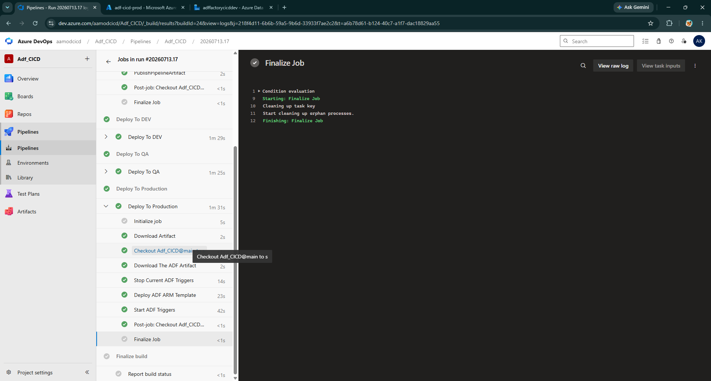

# Week 5 — Continuous Deployment: QA, Production & Approval Gates

## 🎯 Sprint Goal
Close the loop: take the ARM template artifact produced in Week 4 and promote it safely through QA into an approval-gated Production deployment — the payoff for every architectural decision made in Weeks 1–4.

## 📋 Scope for the Week
- QA and Production resource provisioning
- Variable Groups (per-environment)
- Service Connection (Azure Resource Manager)
- ARM parameter override files per environment
- `cd-deploy.yaml` reusable deployment template
- Pre/post deployment PowerShell script integration
- Manual approval gate (Azure DevOps Environments)
- Full pipeline dry run: Dev → QA → Prod
- Final documentation and internship summary

## 📸 Visuals

---

## 🗓️ Daily Breakdown

### Day 1 — QA & Production Resource Provisioning
- Provisioned QA and Production environments identically to Dev's Week 1 setup: Data Factory, Azure Blob Storage (hierarchical namespace enabled), Key Vault — each in its own resource group (`ADF-CICD-QA`, `ADF-CICD-Prod`).
- Repeated the Week 2 RBAC pattern for both new environments: Managed Identity → `Storage Blob Data Contributor`, Key Vault → Access Policy → Get/List permissions.
- **Consistency check:** deliberately re-used the exact same naming convention across environments (`adf-<project>-{env}`) so that ARM parameter overrides later would only need to change a predictable, minimal set of values.

### Day 2 — Variable Groups & Service Connection
- Created three Library Variable Groups: `dev-group`, `qa-group`, `prod-group`, each holding `resourceGroup`, `dataFactoryName`, and `subscriptionId` for its environment.
- Created the Azure DevOps **Service Connection** (Azure Resource Manager type), which auto-provisions a Service Principal / App Registration in Azure AD.
- **Scoping decision:** initially scoped the connection to a single resource group, then widened it to cover all three project resource groups — documented trade-off: one service connection with broad scope is operationally simpler to maintain than three narrowly-scoped connections, appropriate for a project of this size; a stricter, single-resource-group-per-connection model is noted as more appropriate for larger, multi-team, higher-sensitivity projects.

### Day 3 — ARM Parameter Override Files
- Created `cicd/arm-params/dev.json`, `qa.json`, and `prod.json`, each cloned from the Week 4 published `ARMTemplateParametersForFactory.json` and edited to point at the correct environment's Key Vault, storage account, and API endpoint values.
- This is the file set responsible for preventing the most damaging class of deployment bug in this entire project: **a Data Factory in one environment silently pointing at another environment's storage or secrets.**

### Day 4 — Building `cd-deploy.yaml` (Reusable Deployment Template)
- Authored the reusable deploy template, parameterized by `dataFactoryName`, `resourceGroup`, `subscriptionId`, `environment`, and `azureResourceManagerConnection`.
- Step sequence:
  1. `DownloadPipelineArtifact@2` — pulls the `ARMTemplate` artifact published by the CI stage
  2. `AzurePowerShell@5` (pre-deployment) — runs the Microsoft-provided script with `-predeployment $true`, stopping any currently running triggers before deployment touches the factory
  3. `AzureResourceManagerTemplateDeployment@3` — deploys in **Incremental** mode, using `arm-params/${{ parameters.environment }}.json` as the override file
  4. `AzurePowerShell@5` (post-deployment) — runs the same script with `-predeployment $false -deleteDeployment $true`, removing orphaned objects and restarting previously-active triggers

### Day 5 — Wiring Dev + QA Stages & First Debugging Round
- Wired `DeployToDev` and `DeployToQA` stages into the orchestrator pipeline, both calling `cd-deploy.yaml` with their respective variable group and `environment` parameter.
- First run surfaced three distinct, sequential bugs — each fixed and re-run individually:
  - **Variable group name mismatch** (`group dev` referenced in YAML vs. `dev-group` actually created in Library) → standardized naming and fixed the reference
  - **Hardcoded `qa.json` reference** inside `cd-deploy.yaml` regardless of which environment was deploying → introduced the `environment` parameter and switched to `arm-params/${{ parameters.environment }}.json`
  - **`DeployToDev` pulling QA's variable group by copy-paste mistake**, causing it to look for `ADF-QA` inside the `Dev` resource group → corrected the per-stage variable group reference
- After fixes: full green run, both Dev and QA deployed in parallel, verified by opening each environment's ADF Studio and confirming linked services pointed at the **correct** environment's storage and Key Vault — the single most important verification step in the whole project.

### Day 6 — Production Stage, Approval Gate & Trigger Continuity
- Created an Azure DevOps **Environment** named `PROD`, added an **Approval** check with the project owner as the sole approver.
- Converted the Production stage's job type from a standard `job` to a `deployment` job — required specifically to reference an Environment and therefore gate on approval.
- Set `dependsOn: DeployToQA` explicitly on the Production stage (an earlier draft was missing this and would have deployed to Prod and QA simultaneously — caught before the first real run).
- Ran the full pipeline end-to-end for the first time: Dev and QA deployed automatically and in parallel; the pipeline then **paused and waited** at the Production gate exactly as designed, requiring an explicit manual approval before continuing.
- Approved the gate, watched Production deployment complete, then verified in the Prod ADF Studio: pipelines present, linked services correctly pointed at Prod's storage and Key Vault, and — critically — the schedule trigger came back **on** automatically via the post-deployment script, exactly matching its pre-deployment state.

### Day 7 — Final Hardening, Parameters File Safety Check & Documentation
- Deliberately tested a failure scenario before calling the project complete: uploaded an incorrect file type (`.txt` instead of `.json`) to the Production `parameters` container to confirm the pipeline fails safely and legibly rather than deploying bad configuration — confirmed it does, and documented this as the reason the parameters file upload for Production is kept as a **manual, reviewed step** rather than an automated CLI task in this project's design (see [Security Implementation](../README.md#security-implementation) in the master README).
- Re-ran the corrected version successfully.
- Wrote the final master `README.md` and consolidated all five weekly logs into their final form.

---
  +
## 🏗️ Deliverables Built This Week

| Item | Status |
|---|---|
| QA + Prod environments (Data Factory, Storage, Key Vault, RBAC) | ✅ |
| `dev-group` / `qa-group` / `prod-group` Variable Groups | ✅ |
| Azure Resource Manager Service Connection | ✅ Scoped to all 3 resource groups |
| `cicd/arm-params/{dev,qa,prod}.json` | ✅ |
| `cicd/cd-deploy.yaml` reusable deployment template | ✅ |
| `DeployToDev`, `DeployToQA` stages | ✅ Automated, parallel-eligible |
| `DeployToProd` stage | ✅ Gated behind `PROD` Environment approval |
| Full pipeline dry run (Build → Dev → QA → Prod) | ✅ Verified end-to-end |
| Master README + 5 weekly logs | ✅ Completed |

---

## 🧠 Technical Decisions

| Decision | Reasoning |
|---|---|
| Single broadly-scoped Service Connection | Simpler operational overhead for a project of this size; documented as a trade-off, not a universal recommendation |
| `Incremental` deployment mode for all environments | Prevents accidental deletion of unrelated resources in the resource group; `Complete` mode is explicitly avoided |
| Manual parameters-file upload for Production only | Deliberate "automation vs. safety" trade-off — the highest-blast-radius file in the pipeline gets a human review step, even though it could technically be automated |
| `deployment` job type (not `job`) for the Production stage | Required to attach an Azure DevOps Environment and therefore enforce the approval gate |
| Explicit `dependsOn: DeployToQA` on Production | Prevents Production from deploying in parallel with QA — sequencing must be intentional, not assumed from stage order in the file |

---

## 🚧 Problems & Solutions

| Problem | Solution |
|---|---|
| `variable group could not be found` | Corrected mismatched variable group name reference in YAML |
| ARM parameter file hardcoded to `qa.json` regardless of target environment | Introduced dynamic `environment` parameter: `arm-params/${{ parameters.environment }}.json` |
| Dev stage referencing QA's variable group | Fixed per-stage variable group binding |
| Production initially deploying in parallel with QA instead of after it | Added explicit `dependsOn: DeployToQA` |
| Production deployment failed — wrong file type uploaded to `parameters` container | Confirmed pipeline fails safely; re-uploaded correct `.json` file; documented as an intentional manual checkpoint |
| Duplicate/ambiguous job naming when copying the Deploy job across environments | Renamed each job uniquely (`DeployToDev`, `DeployToQA`, `DeployToProd`) |

---

## 📚 Learnings

- The Production approval gate isn't just a checkbox — it fundamentally changes the job type required in YAML (`deployment` vs. `job`), which has real structural implications for how the pipeline is authored, not just how it behaves at runtime.
- Testing a **failure path** deliberately (the bad parameters file) before declaring the project done surfaced more confidence in the pipeline's safety than any number of successful runs would have on their own.
- Environment parity, established carefully back in Week 1 and Week 2, is what made the Week 5 parameter-override files simple, predictable, and low-risk to write — most of the "hard work" of a safe CD pipeline actually happens in environment setup, long before any deployment YAML is written.
- Pre/post deployment scripts solve a real, specific gap (ARM's inability to safely delete removed ADF objects) rather than being boilerplate — understanding *why* they run twice, with different flags, was necessary to trust the automation rather than just copy it.

---

## 🏁 Internship Summary

Over five weeks, this project moved Azure Data Factory from an ungoverned, single-developer "Live Mode" tool into a fully version-controlled, environment-isolated, approval-gated CI/CD pipeline modeled on real data engineering team practices:

- **Week 1** established the multi-environment Azure foundation (Dev/QA/Prod resource groups, Data Factory, Storage, Key Vault).
- **Week 2** introduced Git governance — branch protection, pull requests, and the Managed Identity access model that removed hardcoded credentials entirely.
- **Week 3** replaced static, single-purpose pipelines with one dynamic, config-driven pipeline capable of processing an arbitrary number of sources without code changes.
- **Week 4** built and validated the Continuous Integration half of the pipeline — automated ARM template export, matched byte-for-byte against the manual Publish baseline.
- **Week 5** closed the loop with a fully automated, approval-gated Continuous Deployment pipeline promoting the same artifact safely through Dev, QA, and Production.

Every problem documented across these logs — YAML indentation errors, variable group mismatches, RBAC vs. Access Policy confusion, a deliberately-tested bad parameters file — was encountered and resolved hands-on, not abstracted away. The resulting pipeline reflects working, tested infrastructure, not a theoretical walkthrough.

## ✅ Week 5 Deliverables
- [x] QA and Production environments fully live and RBAC-configured
- [x] Complete CD pipeline: Dev → QA → Prod with approval gate
- [x] Pre/post deployment trigger-safety scripts verified in production
- [x] Deliberate failure-path test completed and documented
- [x] Full documentation set (master README + 5 weekly logs) finalized

---

**Project Status:** ✅ Complete — see [`README.md`](../README.md) for full architecture, setup, and configuration reference.
